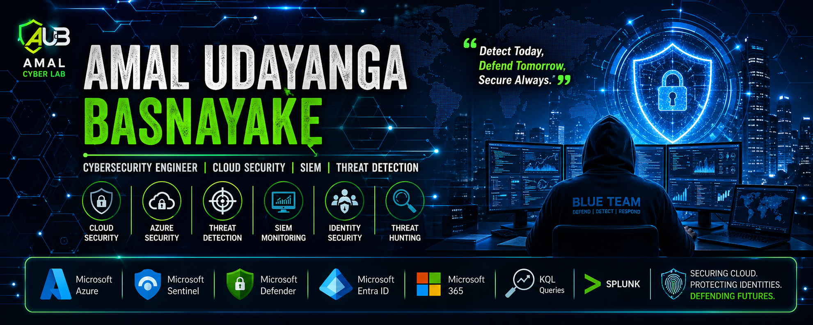

  

<h1 align="center">Hi 👋 I'm Amal Udayanga Basnayake</h1>

<h3 align="center">Cybersecurity Engineer | Cloud Security | Azure Security | SIEM | Threat Detection</h3>

  

  

---

# 👨‍💻 About Me

🔐 Cybersecurity professional focused on **Cloud Security, SIEM Monitoring, and Threat Detection**.

- 🏫 IT & Systems Specialist at **Musaeus College**
- ☁️ Working with **Microsoft Azure Cloud Infrastructure**
- 🛡️ Focused on **Blue Team Security & Cyber Defense**
- 📚 Following **Azure Security Engineer Certification Path (AZ-500)**
- 🚀 Building **Real-World Cloud Security Labs**
- 🔍 Focused on **Identity Security, SIEM Monitoring, and Threat Detection**

---

# 🛡️ Core Security Skills

- Identity & Access Management  
- Cloud Security Architecture  
- SIEM Monitoring  
- Threat Detection  
- Incident Response  
- Log Analysis  
- Security Monitoring  
- Threat Hunting  

---

# ☁️ Cloud Security Technologies

---

# 🚀 Featured Cybersecurity Projects

### 🛡️ Azure WAF + Application Gateway Security Lab  
Implemented secure web traffic inspection using Azure WAF with OWASP protection.

### 🔐 Azure Just-in-Time VM Access Security Lab  
Secured Azure virtual machines using Microsoft Defender Just-in-Time access controls.

### 🌐 Azure DDoS Protection Hands-On Lab  
Configured cloud-native mitigation against volumetric attack scenarios.

### 📊 Microsoft Sentinel SOC Monitoring Lab  
Built SIEM-based threat monitoring and alert analysis workflows.

### ☁️ Azure Hub-Spoke Security Architecture  
Designed enterprise-style secure network segmentation in Azure.

---

# 🌐 Security Portfolio

🔗 https://amalcyberlab.vercel.app

---

# 📊 GitHub Stats

---

# 📈 GitHub Activity Graph

---

# 📚 Latest Cybersecurity Focus Areas

- Azure Security Engineering  
- Cloud Threat Detection  
- SIEM & SOC Monitoring  
- Microsoft Sentinel Automation  
- Security Architecture Design  

---

⭐ Always building **real-world cybersecurity labs** and security-focused cloud solutions.
