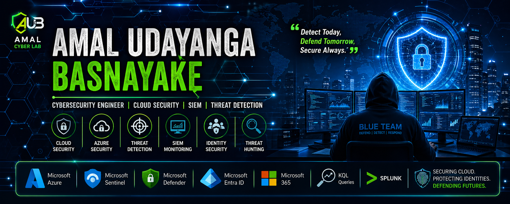

<p align="center">
  
</p>

<h1 align="center">Hi 👋 I'm Amal Udayanga Basnayake</h1>

<h3 align="center">Cybersecurity Engineer | Azure & Cloud Security | SIEM & SOC | Identity | AI Security</h3>

<p align="center">
  
</p>

<p align="center">
  <a href="https://amalcyberlab.vercel.app">
    
  </a>
  <a href="https://www.linkedin.com/in/amal-udayanga-basnayake">
    
  </a>
  <a href="https://github.com/AmalUBasnayake">
    
  </a>
  <a href="https://medium.com/@amalubasnayake">
    
  </a>
</p>

<p align="center">
  
</p>

---

## 🧭 Professional Profile

Cybersecurity and cloud-focused IT professional with **5+ years of enterprise IT operations experience**, specializing in Microsoft 365 security, Azure security, SIEM engineering, threat detection, identity protection, and security automation.

Currently working as an **IT & Systems Specialist** supporting a Microsoft 365 environment with **4,000+ users**, while building toward a long-term career in **Cybersecurity Engineering, Cloud Security, AI Security, Security Architecture, and Governance**.

### 🔹 Current Focus

| Domain | Engineering Focus |
|---|---|
| 🔐 Identity | Entra ID, Conditional Access, MFA, PIM, RBAC, Managed Identity |
| ☁️ Cloud | Azure Security, Firewall, WAF, DDoS, Key Vault, Private Endpoints |
| 🛡️ SOC / SIEM | Microsoft Sentinel, Splunk, KQL, Threat Hunting, SOAR |
| 🔍 Detection | Incident Response, Sysmon, AD Monitoring, Log Analysis |
| 🤖 AI Security | Azure OpenAI Security, AI Data Protection, Purview, DLP |
| 📋 Governance | ISO/IEC 27001, ISO/IEC 27701, Risk & Security Management |
| 🏗️ Architecture | Zero Trust, Secure Cloud Architecture, Security-by-Design |

---

## 🎓 Education — BSc (Hons) Cyber Security

### University of Wolverhampton 🇬🇧

**BSc (Hons) Cyber Security — Top-Up Degree**  
📅 **Starting September 2026**

I am continuing my academic development with a focus on connecting university-level cybersecurity theory with practical security engineering.

### Core Study Areas

| Module | Credits | Engineering Connection |
|---|---:|---|
| 🔎 Digital Forensics | 20 | Evidence, investigation, incident analysis |
| 🛡️ Risk & Cyber Security Management | 20 | Risk, controls, governance, residual risk |
| 🧠 Cyber Threat Intelligence | 20 | Threat actors, intelligence, ATT&CK, detection |
| 🌐 Advanced Networks | 20 | Network architecture, protocols, segmentation, security |
| 🏗️ Project & Professionalism | 40 | Security project delivery, architecture, documentation |

> **Goal:** Build the academic foundation required to progress from hands-on security operations into security engineering, architecture, governance, and leadership.

---

# 🧠 Engineering Mindset

I don't want to learn cybersecurity as a collection of tools.

I focus on understanding the complete security system:

```text
Business Requirement
        ↓
Critical Asset
        ↓
Threat
        ↓
Risk
        ↓
Security Requirement
        ↓
Control
        ↓
Implementation
        ↓
Evidence
        ↓
Monitoring
        ↓
Detection
        ↓
Response
        ↓
Recovery
        ↓
Continuous Improvement
```

### The questions I ask

> **What are we protecting?**

> **Why does it matter to the business?**

> **Who or what needs access?**

> **What can go wrong?**

> **How would we detect it?**

> **How would we contain it?**

> **What evidence would prove the control works?**

> **What residual risk remains?**

---

# 🏆 Key Achievements

| Achievement | Impact |
|---|---|
| 🔐 MFA & Conditional Access | Applied identity protection across **4,000+ users** |
| 🛡️ Microsoft 365 Security | Managed enterprise-scale identity and security controls |
| 🤖 SOAR Automation | Built automated security response workflows |
| 🔎 SIEM Engineering | Developed Microsoft Sentinel & Splunk monitoring and detection |
| 🖥️ Endpoint Security | Applied hardening and monitoring practices |
| 📉 Infrastructure Reliability | Achieved **35% reduction in system downtime** in previous role |
| ⚡ IT Operations | Improved help desk resolution efficiency by **40%** |
| 🔬 Security Labs | Built **40+ hands-on cybersecurity labs** |

---

# 🛡️ Technology & Security Stack

<p align="center">


<br>


<br>


</p>

---

# 🚀 Featured Security Engineering Projects

## 🔵 SOC / SIEM Engineering

| Project | Engineering Outcome |
|---|---|
| **Microsoft Sentinel SIEM Threat Detection Lab** | KQL analytics rules, telemetry ingestion, alerting and investigation |
| **Sentinel SOAR Automated IP Blocking** | Logic Apps-based automated incident response |
| **Azure Sentinel Honeypot Live Attack Map** | Honeypot telemetry and real-time attack visualization |
| **SOC Dashboard Monitoring Lab** | Alert triage, monitoring and investigation workflows |
| **Brute Force Attack Detection** | Authentication attack detection and response |
| **Splunk Real-Time Security Dashboard** | Security visibility and operational monitoring |
| **Splunk Network SOC Dashboard** | Network threat visibility and SOC monitoring |

## ☁️ Azure Cloud Security

| Project | Engineering Outcome |
|---|---|
| **Azure Firewall Hub-Spoke Security Architecture** | Segmentation, centralized inspection and controlled traffic flow |
| **Azure WAF + Application Gateway Security** | Web application protection and OWASP-aligned inspection |
| **Azure DDoS Protection Lab** | Cloud-native volumetric attack mitigation |
| **Azure Key Vault Hardening** | Secrets and cryptographic key protection |
| **Key Vault + Managed Identity** | Passwordless workload authentication and RBAC |
| **Azure Just-in-Time VM Access** | Reduced administrative exposure |
| **Azure Storage Private Endpoint Security** | Private access and reduced public exposure |
| **Azure Secure Web Load Balancer / HA** | Highly available secure web architecture |
| **Azure PaaS Web App + SQL Architecture** | Secure PaaS workload design |
| **Azure NSG + IIS Web Server Security** | Network access control and workload hardening |

## 🔐 Identity & Zero Trust

| Project | Engineering Outcome |
|---|---|
| **Conditional Access + MFA Security Lab** | Identity-based access enforcement |
| **IAM + PIM Security Lab** | Just-in-time privileged access |
| **Microsoft Entra ID Security Lab** | Authentication, authorization and identity lifecycle |
| **Managed Identity Security Lab** | Passwordless workload identity |
| **Identity-Based Zero Trust Lab** | Identity as a security boundary |
| **Microsoft 365 Identity Security Lab** | Enterprise identity protection |

## 🤖 AI & Cloud Security

| Project | Engineering Outcome |
|---|---|
| **Azure OpenAI Security & AI Automation Lab** | Secure AI architecture, identity, monitoring and automation |
| **Azure OpenAI Private Endpoint Security** | Private access with identity, RBAC, logging and egress considerations |
| **Purview AI Shield / DLP Lab** | AI data protection and information governance |
| **AI Security Architecture Lab** | Threat-aware design for AI workloads |
| **AI Data Protection Lab** | Protection of sensitive information used by AI |
| **AI Security & Governance Research** | Identity, data, monitoring and governance considerations |

## 🔍 Threat Detection & Infrastructure

| Project | Engineering Outcome |
|---|---|
| **Windows Persistence Detection using Sysmon** | Endpoint threat hunting |
| **Registry-Based Threat Detection** | Malicious registry modification detection |
| **Active Directory Monitoring** | Authentication and attack-pattern analysis |
| **Network Traffic Analysis** | Traffic monitoring and anomaly detection |
| **Security Log Analysis** | Security telemetry investigation |
| **Threat Hunting Lab** | Proactive threat investigation |
| **Incident Investigation Lab** | Evidence analysis and response |
| **Nessus Vulnerability Assessment** | Infrastructure vulnerability identification |
| **Windows Endpoint Hardening** | Endpoint security baseline implementation |
| **Group Policy Security Lab** | Centralized Windows security controls |

---

# 🧪 40+ Hands-On Cybersecurity Labs

My lab portfolio covers multiple security engineering domains:

| Domain | Coverage |
|---|---|
| 🛡️ **SOC / SIEM** | Sentinel • Splunk • KQL • Alert Triage • SOAR • Incident Response |
| ☁️ **Azure Security** | Firewall • NSG • WAF • DDoS • Key Vault • Private Endpoint • PaaS |
| 🔐 **Identity** | Entra ID • MFA • Conditional Access • PIM • RBAC • Managed Identity |
| 🤖 **AI Security** | Azure OpenAI • AI Data Protection • Purview • DLP • AI Governance |
| 🔍 **Threat Detection** | Sysmon • AD Monitoring • Persistence • Registry • Brute Force • Network Analysis |
| 🖥️ **Infrastructure** | Windows • AD • GPO • Endpoint Hardening • Nessus |
| 📋 **Governance** | Security Risk • Controls • Evidence • Audit & Compliance Concepts |

---

# 📜 Certifications & Professional Development

## Microsoft Security

| Certification / Learning | Status |
|---|---|
| 🔄 **SC-500 — Microsoft Cloud & AI Security Engineer** | In Progress |
| 🔄 **AZ-500 — Microsoft Azure Security Engineer** | In Progress |
| ✅ **Microsoft Applied Skills — Create Agents in Microsoft Copilot Studio** | Completed |
| 📚 **MS-102 Microsoft 365 Administration Learning Path** | Completed / Learning |

## ISO / Governance

| Certification | Status |
|---|---|
| ✅ **ISO/IEC 27001:2022 Lead Auditor** | Certified |
| ✅ **ISO/IEC 27701:2025 Lead Auditor** | Certified |

## Cybersecurity & Networking

| Certification / Pathway | Status |
|---|---|
| ✅ **Certified Red Team Operations Management (CRTOM)** | Certified |
| ✅ **Certified SME Cyber Security Officer (CSCSO)** | Certified |
| ✅ **Blue Team Junior Analyst Pathway** | Completed |
| 🎓 **ISC2 Candidate** | Active |
| ✅ **CCNA — Cisco Networking Academy** | Completed |
| ✅ **Cyber Threat Management — Cisco** | Completed |
| ✅ **Wireshark & Network Analysis** | Completed |

---

# 🎓 Academic Foundation

### Pearson BTEC Level 5 Higher National Diploma in Cybersecurity

**Achievers International Campus, Sri Lanka**  
**2024 – April 2026**

| Result | Module |
|---|---|
| 🏆 **Distinction** | Digital Forensics |
| 🏆 **Distinction** | Information Security Management Systems (ISMS) |
| 🥈 **Merit** | Cybersecurity |

---

# 🏗️ Current Engineering Roadmap

```text
IT Operations
      │
      ▼
Cybersecurity Operations
      │
      ▼
Security Engineering
      │
      ▼
Cloud Security Engineering
      │
      ├──────────────┐
      ▼              ▼
 AI Security     Governance & Risk
      │              │
      └──────┬───────┘
             ▼
    Security Architecture
             │
             ▼
   Enterprise Security Leadership
```

### Core Development Areas

- ☁️ Cloud Security Engineering
- 🔐 Identity & Access Security
- 🛡️ SOC / SIEM Engineering
- 🤖 AI Security
- 🔍 Threat Detection & Response
- ⚙️ Security Automation
- 📋 Governance, Risk & Compliance
- 🏗️ Security Architecture

---

# 🧠 Security Engineering Philosophy

> **The engineer learns how the control works.**  
> **The architect understands how the controls form a system.**  
> **The leader understands why the system matters to the enterprise.**

My objective is to develop all three perspectives.

```text
Requirement
    ↓
Risk
    ↓
Control
    ↓
Implementation
    ↓
Evidence
    ↓
Audit
    ↓
Detection
    ↓
Response
    ↓
Improvement
```

---

# 🌐 Amal Cyber Lab

<p align="center">
  <a href="https://amalcyberlab.vercel.app">
    
  </a>
</p>

A practical cybersecurity portfolio focused on:

**Security Labs • Cloud Security • SIEM • Threat Detection • Identity • AI Security • Architecture • Technical Writing**

---

# ✍️ Technical Writing

I share practical cybersecurity and cloud security research through technical articles covering:

- Azure Security
- Microsoft Sentinel
- SIEM & SOC Operations
- Identity & Zero Trust
- Cloud Security Architecture
- Azure OpenAI Security
- AI Security
- Threat Detection
- Security Engineering
- Governance & Risk

<p align="center">
  <a href="https://medium.com/@amalubasnayake">
    
  </a>
</p>

---

# 📊 GitHub Statistics

<p align="center">
  
  
</p>

<p align="center">
  
</p>

---

# 📈 GitHub Activity

<p align="center">
  
</p>

---

# 🤝 Connect With Me

<p align="center">
  <a href="https://amalcyberlab.vercel.app">
    
  </a>
  <a href="https://www.linkedin.com/in/amal-udayanga-basnayake">
    
  </a>
  <a href="https://medium.com/@amalubasnayake">
    
  </a>
  <a href="https://credly.com/users/amaludayanga-basnayake">
    
  </a>
</p>

---

<p align="center">
  
  
  
  
</p>

<p align="center">
  <strong>🛡️ Build. Break. Detect. Defend. Automate. Learn.</strong>
</p>
